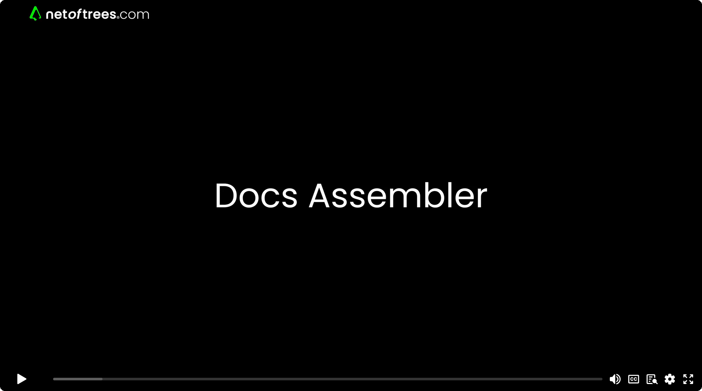

# Docs Assembler - Treat Documentation Like Code

This is an experimental port from a c# server/database application - to a GitHub repo/vscode extension. A concept driven by transformational conversations with a robotics firm - [HAL Robotics](https://hal-robotics.com).  

 > **To truly understand how it works, we encourage you to explore the [Live Demo](https://docsassemblerdemo.netoftrees.com/).**  
 >It was built with this version of the extension, which we've released for hands-on experimentation.  
 >*Please note: This is an early release with known limitations. We advise caution for critical work until the production-ready version is released later this year.*

### *Solve documentation hell,*

- **Sprawling, duplicated content** across guides, manuals, and wikis.
- **Bug-prone updates** make an edit in one place, miss it in ten others.
- **Brittle, unmanageable docs** that can't handle complex, branching scenarios.

### *by applying the principles of software engineering to the text,*

Docs Assembler is a VS Code extension that lets you build documentation systems with **modular, reusable components**. Think of it like **classes for your content**.

- **Maps (.tsmap files)**: Self-contained documentation modules that can be nested and composed, just like classes. Encapsulate text, or decision trees.
- **Variables**: Define reusable text snippets. Change one, update everywhere.
- **Inheritance & Composition**: Build complex guides from simple, reusable blocks. A change in a base propagates to all guides that use it.
- **Compile to Docs**: Assemble these components on-the-fly into flawless, context-aware Markdown or HTML.

### *and maintain a single source of truth.*

## Designed for Developers, by Developers

The design of Docs Assembler was driven by a fundamental need from teams like [HAL Robotics](https://hal-robotics.com): to have a powerful system that *respects developer workflows and sovereignty*. This isn't just a platform; it's a philosophy built on core principles that will feel immediately right:

*   **Familiarity & Control:** The entire system is built on the tools you already know and trust. Your documentation lives in Git repos, right alongside your code. Content is written in Markdown files, editable in any editor. Structure is defined in JSON files you can view and edit manually.
*   **Absolute Ownership:** You have physical possession of your documentation. It's your Markdown and JSON in your repo. You are never trapped in a subscription or held ransom by a SaaS platform.
*   **Zero Lock-In:** This is a critical feature. There are no consequences if you stop using Docs Assembler. Since it publishes to standard Markdown, you can uninstall the extension and your documentation is still perfectly usable, editable, and ready for any other static site generator. Your content is always yours.
*   **Seamless Publishing:** It’s designed to publish directly to [GitHub Pages](https://docs.github.com/en/pages), a platform developers already understand. Even Liquid scripts embedded in your Markdown work as expected.
*   **Built to Scale:** Like classes break down massive software systems, Docs Assembler's modules are designed to decompose enormous documentation sets into manageable, distributable units that different teams can own.
*   **Engineering Rigour:** It brings true software tooling to docs, with IntelliSense for variables, full validation before publish, and automatic handling of relative URLs that are defined as variables. This ensures any local files referenced by these URL variables are automatically discovered and copied to the publish folder, preventing broken links and ensuring robustness.

## Live Demo

- **Live Demo GitHub Pages Site**: [See it in action](https://docsassemblerdemo.netoftrees.com/)  
    - Publish currently targets GitHub Pages, producing Jekyll Markdown.  
    - After a Publish run a Git Commit and Push for GitHub Pages to make changes live. 

- **GitHub Pages Repository**: [Explore the repo](https://github.com/CompositeFlows/DocsAssemblerDemo/)  
    - The sample maps are located in the `/tsmaps/` folder and published guides in `/docs/`.  

- **Frontend Renderer**: [TypeScript Source Code](https://github.com/CompositeFlows/fragment-renderer)  
    - Client-side application that renders the published content in the live demo.

- **Sandbox Repository**: [Sandbox repo](https://github.com/CompositeFlows/DocsAssemblerDemoSandbox/)
    - All-in-one repository with docs, FragmentRenderer, and Jekyll setup
    - Supports full local workflow: assemble docs → publish → Jekyll build → local preview
    - Everything needed to develop, test, and preview documentation changes locally
    - Instructions on running repo locally with Jekyll coming soon.

## Bugs, questions or feedback? - Email us
[team@netoftrees.com](mailto:team@netoftrees.com)

### After an extension update clear vscode history:  
- Open the Command Palette: _Cmd+Shift+P_  
- Type: _Clear Editor History_

## Quick walkthrough
Using a fork of the HAL Robotics documentation repo, initialised to use maps - [HAL.Documentation.maps](https://github.com/CompositeFlows/HAL.Documentation.maps).   
It serves as a good example for simple use cases - as there are only shared variables and steps, no linked maps. 
#### BE AWARE: This is not the current version of HAL Robotics documentation - [see below](#for-up-to-date-information-on-hal-robotics)

    

### Maps
- The main building block is a **map**.
- It is a **json** file with a **.tsmap** extension.
- Functions similarly to a **class** in software.
- [Maps are built to scale up easily](#built-to-handle-both-complexity-and-scale)

#### Switching between **Map Editor** and **Map Json Editor**:

#### Switching between **Maps Diff** and **Maps Json Diff**:

  
  

### Steps
- A **map** is a section of documentation divided into **steps**.
- Each **step** links to a **markdown file** with the step's documentation text.
- **Markdown file** can be shared between multiple **steps**.
- **Markdown files** are editable with the **Visual Studio Code** markdown editor.

  
  

### Maps can reference other maps
- A **map** referenced within another **map**, appears as a single **step**.
- If a referenced **map** has **exits**, other **maps** or **steps** will need chained onto those **exits**.
- **Validation** prevents circular references.

  
  

### Variables
- **Variables** define reusable **markdown text**.
- **Variables** that define relative links are adjusted to be always be valid for the published document they are used in.

  
  

### Variables can reference other variables
- A **variable's** markdown text can reference other **variables**.
- **Validation** prevents circular references.

  
  

### Compile to docs
On **publish**, the **Docs Assembler** reads the **maps** selected for **publish** - it **validates** and assembles all referenced **maps**, **markdown files**, expands any **variables**, copies over referenced **assets**, and **compiles** the resuls into **markdown** or **html** files to the **publish** folder in your **repo**. 

  
  

### Compare published to live
Use the **compare view** to view changes between published files and the **docs** folder files.

  
  

### Move published to live
If the changes are as expected, click-move the published files to the **docs** folder. If you use **GitHub Pages**,  **docs** would be the root folder.

  
  

### Built to handle both complexity and scale
- At its simplest, a **map** has a single **step** and **markdown file**.
- A slightly more complex **map** would be a single pathway of **steps**, like a book or manual.
- At its most complicated, a **map** is a **decision tree** of **steps**, many pointing to other **maps**, which in turn point to other **maps** etc. The expanded result could be enormous, and impossible to buildor maintain without breaking it down into manageable, discrete, reusable, units. Just like we do in code with **classes**.
  

## Example of published output

#### Image above
- This shows the c# server/database application, where **steps** are stored in a database.
    - It has all the **ancillaries** expanded. 
    - When all **ancillaries** are collapsed the **guide** shows enough information for an expert to complete the task. 
    - If a user expands an **ancillary**, they insert more **steps** on a topic. 
    - **Ancillaries** can be nested - so users can drill down.
    - With all possible **ancillaries** expanded, all the **steps** for completing a task, as a novice, are laid out.
- Reusing **maps** makes it straight forward to build and maintain **guides** that a user can tailor to their skill set.

#### Image below
- This shows the editor for the c# server/database application.
    - With the referenced maps, including nested ones, used to build the guide shown above.
    - Most will be reused in other guides.

### Released
- 0.7.449
    - Map folders
    - Intellisense, diagnostics and TextMate grammars for steps and variables
    - Publish listed maps
    - Moving or copying map folder corrects relative urls
    - Map json editor
    - Diff map json editor
    - Maps explorer
    - Map hyper links
    - GitHub Pages integration
    - Publish for referenced and nested maps
    - Publish for ancillaries
    - Update GitHub Pages site with a new demo showing referenced and nested map example using ancillaries
    - Map and guide stacks - published, modified or never published.
    - Move, clone, copy + paste of map folders adjusts relative urls.
    - Move, rename of map asset files updates references and map hyperlinks.
    - Shortcut keys

### Next
- Video tutorial how to set up and publish to GitHub Pages
- Reference other repos

### Upcoming
- Tutorials and help files
- Move or copy a section of a branch
- Make section of branch a new map
- GitLab Pages integration
- Port from database version
    - projects
    - search
    - shape
    - spread
- Light theme
- Docker database + SPA viewer

### Notes

- ***Encapsulation*** - Wrapping a segment of the documentation within a single **map**.
- ***Inheritance*** - Deriving a new **map** from an existing **map** (parent).
- ***Polymorphism*** - Grouping **maps** as members of a common superclass (e.g., tiger, lion => cats).
- ***Abstraction*** - Hiding complex documentation details within a **map** and exposing that **map's interface** to other **maps** as a single **step**.
- ***Composition*** - Composing a **map** of one or more other **maps**.

### Links

[team@netoftrees.com](mailto:team@netoftrees.com)  
[www.netoftrees.com](https://www.netoftrees.com/)  
[x.com/docsassembler](https://x.com/docsassembler)  

### For up to date information on HAL Robotics:

documentation:
[docs.hal-robotics.com](https://docs.hal-robotics.com/)  
documentation repo:
[github.com/HALRobotics/HAL.Documentation](https://github.com/HALRobotics/HAL.Documentation)  
website:
[hal-robotics.com](https://hal-robotics.com/)  

